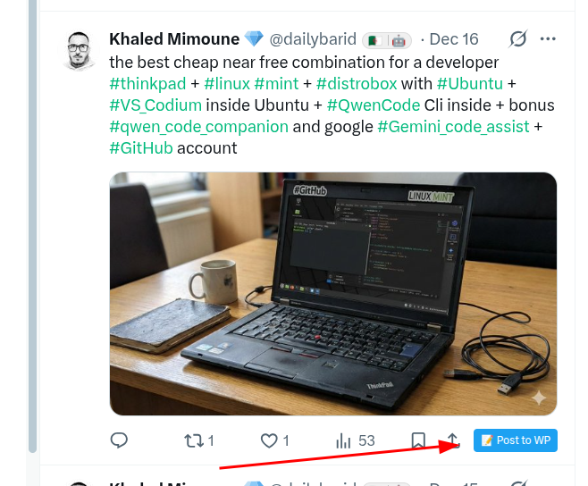
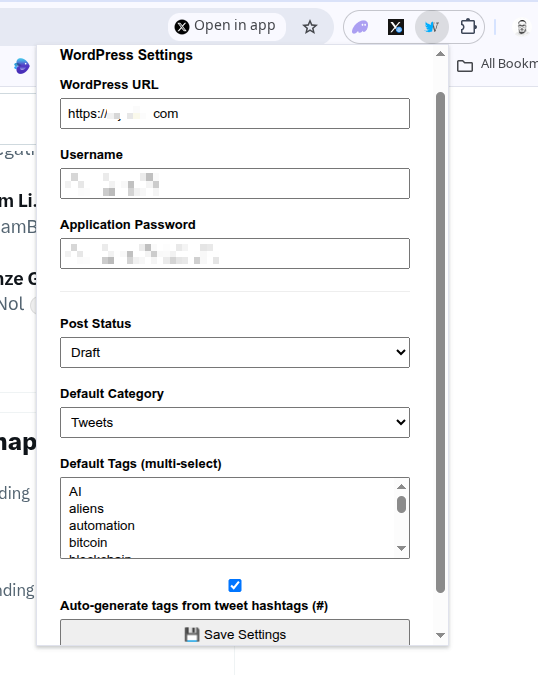

# X to WordPress Auto-Poster  
> 🚀 One-click Chrome extension to turn any X (Twitter) post into a WordPress blog post — with media, categories, tags, and draft/publish control.

## ✨ Features

- ✅ **One-click button** under every tweet on X.com
- 🖼️ **Auto-detect & upload media** (images, videos, OG images from links)
- 📹 **Video support**: Properly handles video tweets and embeds them in WordPress
- 🔄 **Quoted tweet support**: Extracts content and media from quoted tweets
- 🔗 **Interactive content**: Makes URLs, hashtags, and mentions in tweets clickable in WordPress
- 🖼️ **Linked images**: Tweet images link back to original X.com posts
- 🏷️ **Assign categories & tags** (fetched from your WordPress)
- 🏷️ **Auto-generated tags from tweet hashtags** (#hashtag extraction)
- 📝 **Choose draft or publish** mode per your settings
- 🔒 **Secure**: Uses WordPress **Application Passwords** (no OAuth, no third parties)
- 💾 **All data stays on your server** — no external APIs
- 🛠️ **Developer-friendly**: Open, clean, minimal codebase

## 📷 Screenshots

  <table>
    <tr>
      <td align="center"><b>Extension in Action</b></td>
      <td align="center"><b>Toolbar View</b></td>
    </tr>
    <tr>
      <td></td>
      <td></td>
    </tr>
  </table>

## 📦 Installation

### Prerequisites
- WordPress **5.6 or newer** (with REST API enabled)
- HTTPS (required for Chrome extension security)
- A WordPress user with **Author** role or higher

### Step 1: Enable Application Passwords in WordPress
1. check if **Application Passwords** is enabled
2. Go to **Users → Your User → Application Passwords**
3. Add new app: `X Chrome Extension`
4. **Copy the 16-character password** (e.g., `abcd efgh ijkl mnop`)

### Step 2: Load Extension in Chrome
1. Download or clone this repo
2. Open **Chrome → Extensions** (`chrome://extensions`)
3. Enable **Developer mode**
4. Click **“Load unpacked”** and select this folder

### Step 3: Configure
1. Click the extension icon (puzzle piece → your extension)
2. Enter:
   - **WordPress URL**: `https://yourblog.com`
   - **Username**: your WP username (not email)
   - **Application Password**: the one from Step 1
   - (Optional) Default category, tags, post status, and auto-hashtag extraction
3. Click **Save**

### Step 4: Use
- Go to any tweet on X.com
- Click **“📝 Post to WP”** below the tweet
- See it appear in your WordPress as **draft or published post**

## 🔐 Security Model
- Credentials stored in **`chrome.storage.sync`** (encrypted by Chrome)
- Communication uses **HTTPS + HTTP Basic Auth**
- No data leaves your browser except to **your own WordPress site**
- Application Passwords are **scoped to REST API only** — cannot log in to `/wp-admin`

## 🛠️ Development

### Project Structure

├── manifest.json # Extension metadata
├── content.js # Injects button & handles posting logic
├── popup.html / .js # Settings UI (categories, tags, status)

### Build & Reload
- After editing, **reload** in `chrome://extensions`
- Use **Developer mode → Reload** for instant updates

### Debugging
- Open DevTools on X.com → Console for errors
- Extension popup shows **error log** for API failures

## 🤝 Contributing
PRs welcome! Please:
- Keep code minimal and self-contained
- Avoid external dependencies
- Respect user privacy (no telemetry)

## 📜 License
MIT — use freely for personal or commercial projects.

## 💡 Author
Built for indie creators who value **control, privacy, and automation**.